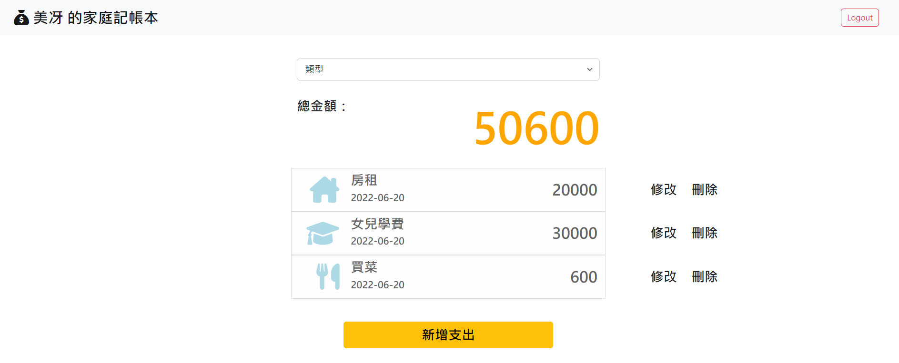
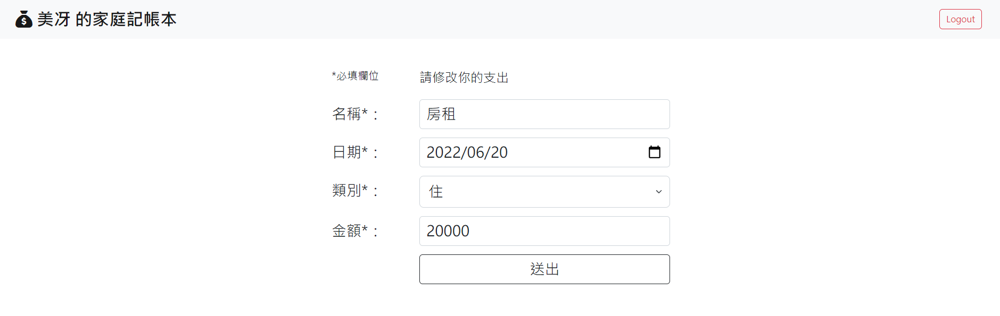
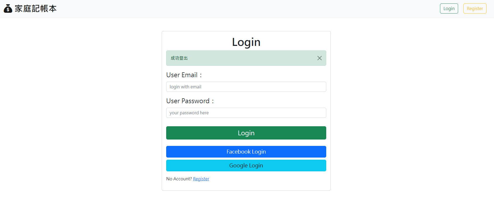

# Expense Tracker

## [Heroku URL](https://expensetracker-46784.herokuapp.com/)

- 登入後首頁
  
- 編輯頁
  
- 登出後顯示頁面
  

## 軟體及模組版本

```
"bcryptjs": "^2.4.3",
"body-parser": "^1.20.0",
"connect-flash": "^0.1.1",
"dotenv": "^16.0.1",
"express": "^4.18.1",
"express-handlebars": "^6.0.6",
"express-session": "^1.17.3",
"method-override": "^3.0.0",
"mongoose": "^6.3.8",
"passport": "^0.6.0",
"passport-facebook": "^3.0.0",
"passport-google-oauth20": "^2.0.0",
"passport-local": "^1.0.0"
```

## 安裝及執行

- 下載至本地

```
git clone https://github.com/wuwachon/Expense_Tracker.git
```

- 安裝相關套件

```
cd Expense_Tracker
npm install
```

- 環境變數設定(`.env.example`檔案修改)

  1. 移除`.example`副檔名
  2. 修改 MONGODB_URI、FACEBOOK_ID、FACEBOOK_SECRET、GOOGLE_ID、GOOGLE_SECRET

- 匯入 seeder 檔案

```
npm run seed
```

Terminal 顯示 Categories created!、Users created、Records created 即表示各種子資料建立成功

- 執行專案

```
npm run dev
```

- 功能測試

  1. Terminal 顯示 http://localhost:3000 即表示啟動完成，可至此網址網頁觀看畫面測試功能
  2. 可自行註冊使用者或由 Facebook、Google 方式登入
  3. 測試帳號可參考[users.json](./models/seeds/users.json)

## 專案功能描述

- 使用者可以註冊帳號，並於註冊之後，可以登入/登出
- 使用者註冊時，若已經註冊過、沒填寫必填欄位、或是密碼輸入錯誤，就註冊失敗，並回應給使用者錯誤訊息
- 使用者登入時，若帳號為註冊過或密碼輸入錯誤，就登入失敗，並回應給使用者錯誤訊息
- 使用者可以直接由 Facebook 或 Google 帳號登入
- 使用者的密碼使用 bcrypt 來處理
- 使用者只有登入狀態可以看到 app 內容，否則一律被導向登入頁
- 使用者在首頁一次瀏覽所有支出的清單
- 使用者只能看到自己建立的資料
- 使用者在首頁看到所有支出清單的總金額
- 使用者可以根據「類別」篩選支出，總金額的計算只會包括被篩選出來的支出總和
- 使用者可以新增、編輯、刪除一筆支出

## 練習技巧

- express-session 與 passport strategies 管理本地及第三方網頁登入登出狀態
- connect-flash 與 middleware 處理暫存訊息
- Schema.Types.ObjectId 與 ref 設定兩個 collection 之間的關聯性
- bcrypt.js 密碼加密處理
- process.env 變數應用
- **async await 語法糖練習**
